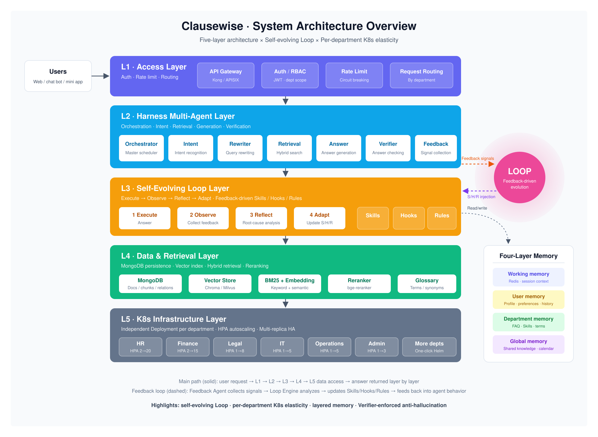

# Clausewise

**A policy document Q&A assistant for multi-department organizations.**

Clausewise ingests official policy documents from every department, answers questions with clause-level citations, and improves itself from user feedback. It works for any organization with many departments — companies, government agencies, hospitals, or universities.

## Features

- **Document ingestion**: parses PDF, DOCX, Markdown, HTML, and TXT asynchronously, splits them by clause, keeps version history, and flags conflicting rules across departments.
- **Trusted answers**: routes each question to the right department, uses hybrid BM25 + vector retrieval with reranking, cites sources as `[Source N]`, and verifies every answer before returning it.
- **Self-improving Loop**: user feedback is turned into Skills, Hooks, and Rules that change future answers, released through canary experiments with automatic rollback.
- **Human review**: auto-generated test questions let department admins check quality; human review is phased out once accuracy stays high.
- **Governed memory**: official documents are the single source of truth; user memory requires consent and filters sensitive data.
- **Role-based access**: users, department admins, and super admins, with strict per-department data isolation.
- **Elastic scaling**: each department agent scales independently on Kubernetes.

## Architecture



| Component | Path | Role |
|---|---|---|
| Web | `web/` | Next.js chat interface and admin console |
| Backend | `backend/` | FastAPI control plane: ingestion, retrieval, memory, Loop, auth |
| Agent runtime | `services/pi-agent/` | Executes the Intent / Rewrite / Answer / Verify / Reflect agents |
| Deployment | `deploy/` | Kubernetes manifests and Helm chart |

Python owns all decisions about permissions, facts, and policies; the pi runtime only executes model calls. If the runtime is unavailable, the backend falls back to local agents.

## Tech Stack

Python 3.11 · FastAPI · MongoDB · Redis · Next.js 15 · React 19 · TypeScript · [pi](https://github.com/earendil-works/pi) · DeepSeek · text-embedding-3-large · bge-reranker-v2-m3 · Docker · Kubernetes · Helm

## Quick Start

Requires [Docker Desktop](https://www.docker.com/products/docker-desktop/).

```bash
git clone https://github.com/CrstalLi02/clausewise.git
cd clausewise
cp .env.example .env        # fill in DEEPSEEK_API_KEY, RELAY_API_KEY, and the secrets
docker compose up --build -d

# Seed departments, glossary, and default rules
docker compose exec backend python -m scripts.seed_data
```

| Service | URL |
|---|---|
| Web app | http://localhost:8080 |
| API docs (Swagger) | http://localhost:8000/docs |
| Agent runtime health | http://localhost:8100/health |

Demo accounts (disable with `SEED_DEMO_USERS=false` in production):

| Role | Username | Password |
|---|---|---|
| User | `student` | `student123` |
| Department admin | `jwc_admin` | `admin123` |
| Super admin | `admin` | `admin123` |

### Adding Your Documents

Put documents in `department_files/<Department Name>/`, then run:

```bash
docker compose exec backend python -m scripts.ingest_department_files --base /app/department_files
```

See [`department_files/README.md`](department_files/README.md) for how folder names map to departments. Sample documents are not included in this repository. The bundled seed data uses a university as an example and can be replaced with your own departments.

## Local Development

Requires Python 3.9+ (3.11 recommended) and Node.js 22.19+.

```bash
# Backend (in-memory mode, no MongoDB/Redis needed)
cd backend && python3 -m venv .venv && source .venv/bin/activate
pip install -r requirements.txt
STORAGE_MODE=memory uvicorn app.main:app --reload --port 8000

# Agent runtime
cd services/pi-agent && npm install && npm run dev      # :8100

# Web
cd web && npm install && BACKEND_URL=http://localhost:8000 npm run dev   # :3000
```

## Configuration

All settings live in [`.env.example`](.env.example). The most important ones:

| Variable | Description |
|---|---|
| `DEEPSEEK_API_KEY` | Chat model API key |
| `RELAY_API_KEY` / `RELAY_BASE_URL` | OpenAI-compatible endpoint for embeddings and reranking |
| `STORAGE_MODE` | `mongo` or `memory` |
| `AUTH_SECRET` / `INTERNAL_API_TOKEN` | Must be strong random values in production |
| `LOOP_PHASE` | `human_in_loop`, `human_on_loop`, or `human_out_of_loop` |

## Testing

```bash
cd backend && pytest                 # 59 tests, runs fully offline
cd web && npm run build
cd services/pi-agent && npm run build
```

## Documentation

- [Architecture](docs/architecture.md) · [API](docs/api.md) · [Deployment](docs/deployment.md) · [Loop Engineering](docs/loop-engineering.md)
- [Technical design](design_files/Clausewise-Technical-Design-Cross-Department-Self-Evolving-Document-Processing-and-QA-Assistant.md) · [Code walkthrough](design_files/Clausewise-Code-Walkthrough-Cross-Department-Self-Evolving-Document-Processing-and-QA-Assistant.md) · [User guide](design_files/Clausewise-Frontend-User-Guide.md)
- Module READMEs: [backend](backend/README.md) · [agent runtime](services/pi-agent/README.md) · [web](web/README.md) · [deploy](deploy/README.md)
