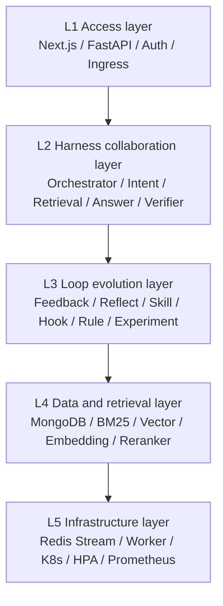
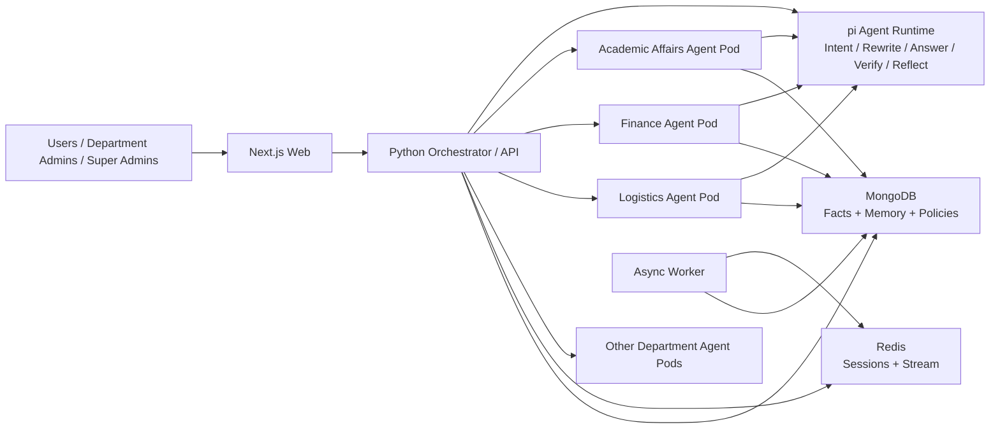
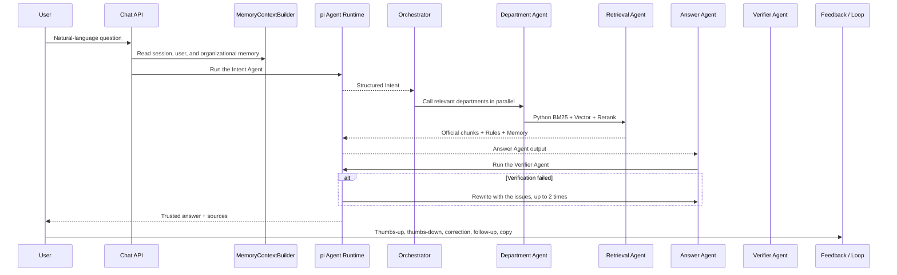
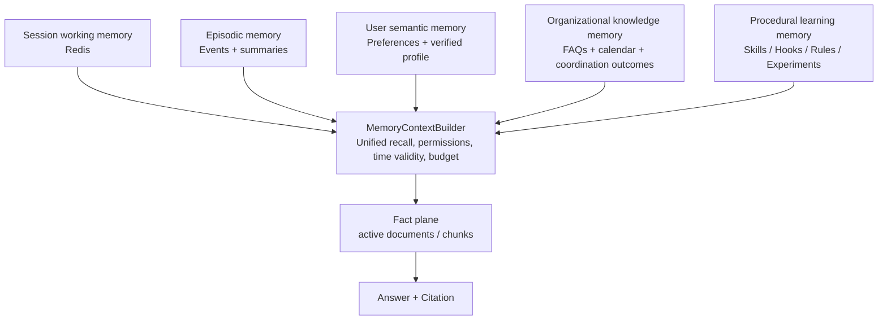
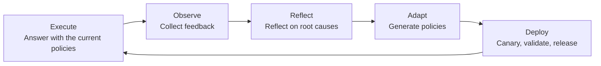

# Clausewise: Code Walkthrough of the Cross-Department Document Processing and Q&A Assistant

## 1. What Problem Does Clausewise Solve?

Any sizable organization — a company, a government agency, a hospital, or a university — has many departments such as HR, Finance, Legal, Operations, and Administration. Each department publishes large numbers of PDFs, Word files, notices, regulations, and service guides.

The traditional approach has three obvious problems:

1. **Scattered files**: employees and members do not know which department, which document, or which version holds the answer.
2. **Inconsistent rules**: different departments may give different rules for the same matter.
3. **Ordinary Q&A systems do not grow**: whatever their level at launch, they are at the same level six months later.

"Clausewise" aims to build a knowledge hub for organizational policies (the bundled demo uses a university as its example dataset):

```text
Departments upload policy files
      ↓
The system automatically parses, chunks, versions, and indexes them
      ↓
Employees and members ask questions in natural language
      ↓
Multiple department agents retrieve and answer collaboratively
      ↓
Answers cite the source text and specific clauses
      ↓
User feedback and review results enter the Loop
      ↓
The system accumulates new Skills / Hooks / Rules, and the next answer gets better
```

If we compare it to a "super service clerk" in an organization:

- MongoDB and the document indexes are its archive room;
- the Intent Agent is the front-desk triage clerk;
- the Retrieval Agent is the archive searcher;
- the Answer Agent is the policy interpreter;
- the Verifier Agent is the reviewer;
- Memory is its memory of sessions, users, and organizational experience;
- the Loop Engine is its teaching-research and retrospective mechanism;
- the K8s department Pods are service windows that can be added temporarily at peak times.

***

## 2. Running the Project

### 2.1 Requirements

- Python 3.9+, Python 3.11 recommended
- Node.js 22.19+
- Docker Desktop, recommended
- Production mode uses MongoDB 7 and Redis 7

### 2.2 One-Command Docker Startup

Run in the project root:

```bash
cp .env.example .env
# Edit .env to configure DEEPSEEK_API_KEY, RELAY_API_KEY, and the security secrets

docker compose up --build -d
docker compose ps
```

Main addresses after startup:

| Service | URL |
| ---------------- | ------------------------------- |
| Student Q&A and admin console | `http://localhost:8080` |
| FastAPI Swagger | `http://localhost:8000/docs` |
| Backend health check | `http://localhost:8000/healthz` |
| pi Agent Runtime | `http://localhost:8100/health` |

> Python is the sole control plane and pi is the unified agent execution engine. pi handles model execution for Intent, Rewrite, Answer, Verify, and Reflect; permissions, facts, memory, the fixed DAG, canary releases, and rollback remain under Python's control.

### 2.3 Initializing Base Data

```bash
docker compose exec backend python -m scripts.seed_data
```

This script writes:

- the demo departments;
- the glossary;
- the organization calendar;
- the default citation rule;
- the default no-fabrication rule;
- the default cross-department Hook.

### 2.4 Importing the Sample Department Documents

```bash
docker compose exec backend \
  python -m scripts.ingest_department_files \
  --base /app/department_files
```

### 2.5 Local Development

Backend:

```bash
cd backend
python3 -m venv .venv
source .venv/bin/activate
pip install -r requirements.txt

export STORAGE_MODE=memory
export EMBEDDING_PROVIDER=hash
export PI_AGENT_ENABLED=true

uvicorn app.main:app --reload --port 8000
```

Frontend:

```bash
cd web
npm install
BACKEND_URL=http://localhost:8000 npm run dev
```

### 2.6 Running the Tests

```bash
cd backend
.venv/bin/pytest -q

cd ../web
npm run build

cd ../services/pi-agent
npm run typecheck
```

The current backend test baseline is **59 passing tests**, covering document chunking, retrieval, permissions, memory, the Loop, version chains, department agents, the pi Runtime, the async queue, baseline Skill execution, and Loop job state.

***

## 3. The Big Picture: What Is the Project Made Of?

### 3.1 Repository Layout

```text
program/
├── backend/                 Main Python FastAPI backend
│   ├── app/api/             REST endpoints and permissions
│   ├── app/harness/         Multi-agent fixed DAG
│   ├── app/pipeline/        Document parsing and ingestion
│   ├── app/retrieval/       BM25, vectors, RRF, Rerank
│   ├── app/memory/          Fact plane and five memory planes
│   ├── app/loop/            Feedback, reflection, policy generation, and rollback
│   ├── app/review/          Human review and progressive exit
│   ├── app/storage/         MongoDB, Redis, queue
│   ├── scripts/             Seeding, ingestion, evaluation, migration, worker
│   └── tests/               Unit and end-to-end tests
├── web/                     Next.js student side and admin console
├── services/pi-agent/       pi unified agent execution engine
├── deploy/                  Docker, K8s, Helm, HPA
├── department_files/        Sample department files
├── design_files/            Technical design and this document
├── docs/                    Architecture, API, Loop, deployment docs
└── loadtest/                k6 department elasticity load-test scripts
```

### 3.2 Five-Layer Architecture



These five layers are not a simple stack:

- L1 handles "who can get in and where requests enter";
- L2 handles "how this question should be answered";
- L3 handles "how the system reviews and improves after answering";
- L4 handles "where the facts are and how to find them";
- L5 handles "whether peaks can be absorbed and whether tasks can be lost".

### 3.3 Service Topology



The most important design point here is: **a department is not a label but a service unit that can truly be deployed and scaled independently.**

### 3.4 Python Control Plane + pi Agent Execution Plane

The refactored system neither migrated the whole backend to TypeScript nor kept two competing Orchestrators; instead, responsibilities are split by determinism:

| Python Control Plane | pi Agent Execution Plane |
| ----------------------- | -------------------------------------------- |
| Auth, RBAC, session ownership | Agent loop |
| Fixed DAG and department routing | Model calls |
| Fact plane and official chunks | Intent / Rewrite / Answer / Verify / Reflect |
| Five memory planes and privacy policies | Structured model output |
| Skills/Hooks/Rules selection | Allowlisted tool calling |
| treatment/control, release, rollback | Local agent execution state |
| Document versions, conflicts, and data storage | No direct access to the business database |

The unified protocol is:

```json
POST /v1/agent/run
{
  "agentType": "answer",
  "systemPrompt": "...",
  "prompt": "...",
  "outputMode": "text",
  "allowedTools": [],
  "timeoutMs": 5000,
  "traceId": "trace_x"
}
```

The endpoint requires `X-Internal-Token`. Python explicitly specifies `allowedTools`, so pi can neither grant itself more tools nor bypass department and fact permissions.

Corresponding code:

- Python client: `backend/app/integrations/pi_runtime.py`;
- pi execution protocol: `services/pi-agent/src/server.ts`;
- pi agent loop: `services/pi-agent/src/agents.ts`.

***

## 4. The Most Important Chain: What Happens After a User Asks a Question?

Code entry points:

- API: `backend/app/api/routes/chat.py`
- Master scheduler: `Orchestrator.answer()` in `backend/app/harness/orchestrator.py`

### 4.1 Main Flow



### 4.2 Step 1: Identity and Session Ownership

The endpoints never trust a `user_id` sent by the client. User identity comes from an HMAC token carrying `iat/exp`.

This means users cannot read other people's sessions by modifying the request body. Session history, feedback, deletion, and long-term memory endpoints all verify ownership.

Corresponding code:

- `backend/app/auth.py`
- `backend/app/api/deps.py`
- `backend/app/api/routes/chat.py`

### 4.3 Step 2: Automatic Department Routing

If the user does not specify a department manually, `DeptRouter` first determines which department the question belongs to.

It uses a three-tier strategy:

1. Fast keyword matching, which is explainable;
2. An LLM semantic judgment when no keyword matches;
3. Searching all available departments when both fail.

For example:

```text
"What is the latest date to submit the graduate thesis proposal?"
→ Matches "graduate, proposal"
→ Routed to the Graduate School or the Sino-French Institute

"How do I get a tuition refund after a leave of absence?"
→ Matches "leave of absence + refund"
→ The Hook expands to Academic Affairs + Finance
```

Corresponding code: `backend/app/harness/agents/dept_router.py`.

### 4.4 Step 3: Building the Memory Context

`MemoryContextBuilder` prepares a governed context before the agents start working:

```json
{
  "session": {
    "summary": "The user is asking about the graduate thesis proposal process",
    "entities": {"matter": "thesis proposal"},
    "recent_messages": []
  },
  "user_items": [
    {"key": "answer_style", "value": "concise"}
  ],
  "org_items": [],
  "procedures": {
    "skills": [],
    "hooks": [],
    "rules": []
  }
}
```

It solves the ellipsis problem in multi-turn conversations:

```text
User: How many words must the graduate thesis proposal be?
System: At least 5,000 words.
User: And what's the latest date to submit it?
```

The "it" in the second question carries no business entity. The system needs to recover "graduate thesis proposal" from the session summary and the previous turn's entities before retrieving.

Corresponding code: `backend/app/memory/context_builder.py`.

### 4.5 Step 4: The Intent Agent

The Intent Agent does not answer; like a hospital triage desk, it outputs a structured plan:

```json
{
  "type": "deadline_query",
  "depts": ["dept_zfxy"],
  "user_role": "student",
  "entities": {"matter": "graduate thesis proposal"},
  "needs_cross_dept": false,
  "confidence": 0.92
}
```

Python first prepares the candidate departments and the governed memory, then has the pi Intent Agent generate the JSON; when pi is unavailable or the output is invalid, it falls back to the local Python LLM/keyword rules.

Corresponding code: `backend/app/harness/agents/intent_agent.py` and `backend/app/integrations/pi_runtime.py`.

### 4.6 Step 5: The Query Rewriter

Users' colloquial wording is not always good for retrieval. The Query Rewriter combines the glossary and session memory to turn one sentence into 1–3 queries better suited for search.

For example:

```text
Original question: How is the withdrawal fee calculated?

Rewritten:
- course withdrawal refund standard
- drop a course tuition refund rate
- withdraw from a course handling fee policy
```

The Query Rewriter's model execution is also handed to pi, while the glossary and session memory come from Python; on failure it falls back to the original Python implementation.

Corresponding code: `backend/app/harness/agents/query_rewriter.py`.

### 4.7 Step 6: Parallel Cross-Department Calls

If a question involves multiple departments, the global Orchestrator calls the department agents in parallel with `asyncio.gather`.

Department Pods are strictly isolated via `DEPT_ID`. For example, the Academic Affairs Pod can only handle `dept_jwc` data; even if a request forges the Finance department, it is rejected.

If a department times out:

- results from the successful departments are still returned;
- the failed department can fall back to a degraded answer from shared retrieval;
- the response notes the `degraded_departments`.

Corresponding code:

- `backend/app/integrations/dept_agent_client.py`
- `backend/app/api/routes/internal.py`
- `backend/app/harness/orchestrator.py`

### 4.8 Step 7: Retrieval, Answering, and Review

Department agents do not let the large model improvise freely; instead they:

```text
Find the source text first → answer based on the source text → review independently at the end
```

The Answer Agent is required to:

- rely only on the given clauses;
- mark key conclusions with `[Source N]`;
- say clearly "No explicit provision was found in the current policy documents" when nothing is found;
- never treat user memory as policy fact.

The Verifier Agent checks:

- whether conclusions are grounded;
- whether they contradict the source text;
- whether key conditions are missing;
- whether the citation format is correct.

A failed verification triggers regeneration with the issues attached, up to twice.

Both Answer and Verifier are executed by the pi Runtime, but the official chunks, Rules, and memory context are chosen by Python. Answer has no autonomous retrieval tools by default, preventing the model from bypassing the fact plane; if tools are opened in the future, they must also go through the `allowedTools` allowlist.

***

## 5. How Do Documents Enter the System?

Document entry point: `POST /api/v1/documents/upload`.

The upload endpoint does not block synchronously for tens of seconds; it writes the file to a shared directory, creates a Redis Stream job, and lets a Worker process it asynchronously.


### 5.1 Async Ingestion

Key code:

- `backend/app/api/routes/documents.py`: upload and job status queries;
- `backend/app/storage/job_queue.py`: the Redis Stream queue;
- `backend/scripts/async_worker.py`: consumes and runs ingestion;
- `backend/app/pipeline/indexer.py`: the actual Pipeline orchestration.

### 5.2 Multi-Format Parsing

`DocumentParser` dispatches by file extension:

| File Type | Parsing Method |
| -------- | ---------------------- |
| PDF | pdfplumber, falling back to pypdf on failure |
| DOCX | python-docx, preserving paragraphs and tables |
| Markdown | Headings, lists, and body text |
| HTML | BeautifulSoup |
| TXT | Line-by-line structuring |

Corresponding code: `backend/app/pipeline/parser.py`.

### 5.3 Cleaning

The cleaner is responsible for:

- removing common page numbers and noise;
- converting full-width characters to half-width;
- normalizing extra whitespace;
- optional OpenCC Traditional-to-Simplified conversion.

Corresponding code: `backend/app/pipeline/cleaner.py`.

### 5.4 Clause-Level Chunking

Policy documents are not suited to crude fixed-token splitting. Clausewise first recognizes:

- Chapter X;
- Section X;
- Article X;
- I., II., III.;
- 1., 2., 3.;
- tables and lists.

The target chunk length is about 300–600 characters. Each chunk stores:

```json
{
  "doc_id": "doc_x",
  "dept_id": "dept_jwc",
  "chunk_index": 3,
  "section_path": ["Chapter 3", "Article 12"],
  "content": "...",
  "content_hash": "...",
  "embedding_id": "doc_x:3",
  "keywords": ["registration period", "deadline"]
}
```

Corresponding code: `backend/app/pipeline/chunker.py`.

### 5.5 Metadata Extraction

The LLM tries to extract:

- the effective date;
- the document type;
- keywords;
- the applicable audience;
- other policy documents referenced.

If the model is unavailable, the Pipeline continues ingestion with conservative defaults, so a single model failure never blocks the whole flow.

### 5.6 Deduplication and Version Chains

This is a very important layer in a policy system.

1. Same file hash in the same department: duplicate ingestion is rejected;
2. New content with the same title in the same department: the version goes from `1.0` to `1.1`;
3. The new document records `supersedes`;
4. The old version is archived only after the new version is fully indexed;
5. Organizational FAQs and derived memory tied to the old version automatically become stale.

This prevents the old policy from being taken offline by mistake when processing of the new version fails.

### 5.7 Transaction-Style Cleanup

Although ingestion is not yet a database transaction, it implements fail-safe cleanup:

```text
Vectorization or indexing fails
→ delete the new document's vectors
→ delete the new chunks
→ delete the unfinished documents record
→ keep the old active version
```

***

## 6. RAG: Why Can the System Find Answers in the Policy Text?

RAG stands for Retrieval-Augmented Generation.

In plain terms: look it up first, then answer.

### 6.1 Hybrid Retrieval

Clausewise uses two retrieval methods at once:

1. **BM25 keyword retrieval**: good at finding exact terms such as "week 8", "28881110", or "withdrawal".
2. **Vector semantic retrieval**: good at understanding that "drop a course" and "course withdrawal" mean nearly the same thing.

The two result lists are fused with RRF:

```text
BM25 ranking ─┐
              ├─ RRF fusion ─ Reranker ─ Top-K chunks
Vector ranking┘
```

Corresponding code:

- `backend/app/retrieval/bm25.py`
- `backend/app/retrieval/vector_store.py`
- `backend/app/retrieval/hybrid.py`
- `backend/app/retrieval/reranker.py`

### 6.2 Why Backfill from MongoDB After Retrieval?

Vector stores usually return only IDs and a little metadata. Clausewise re-reads the full chunk from MongoDB by ID and checks again:

- whether the document is still active;
- whether the chunk exists;
- what the document title is;
- whether the current department has permission.

This step prevents archived policies from continuing to appear in answers.

### 6.3 What Is a Reranker?

If the first retrieval round is the open audition, the Reranker is the semifinal.

It re-compares the candidates recalled by BM25 and vectors against the question and selects the few clauses most worth giving to the large model.

The system prefers `BAAI/bge-reranker-v2-m3`; if the relay service is unavailable, it falls back to a keyword-overlap and clause-number heuristic.

### 6.4 Real Evaluation

Evaluation script: `backend/scripts/evaluate_rag.py`.

Dataset: `backend/evaluation/real_document_qa.json`.

The current sample baseline covers 7 real department files and 10 questions, computing:

- Recall\@5;
- MRR;
- citation accuracy;
- answer key-point consistency.

Offline degraded evaluation results without a real LLM:

| Metric | Result |
| --------- | -----: |
| Recall\@5 | 1.0000 |
| MRR | 1.0000 |
| Citation accuracy | 1.0000 |
| Answer key-point consistency | 0.6333 |

These results show that retrieval and citations are already reliable at this small sample size, but the wording quality of model-free source-text concatenation still has room to improve.

***

## 7. Cross-Department Conflict Detection: The System Not Only Answers but Proactively Finds Problems

Conflict detection is a key capability that sets Clausewise apart from ordinary document Q&A systems.

### 7.1 Two Layers of Candidate Discovery

The first layer is rules:

```text
"According to the Undergraduate Course Registration Regulations..."
"Pursuant to the XX Regulations..."
```

The system identifies reference relations with regular expressions.

The second layer is semantics:

```text
New document chunk
→ vector recall of similar chunks across departments
→ keyword-overlap filtering
→ the LLM judges whether they target the same audience and the same matter with contradictory rules
```

For example:

```text
Academic Affairs: course withdrawal deadline is week 8
Graduate School: course withdrawal deadline is week 10
```

The system does not declare a conflict just because the numbers differ; it also asks the model to judge whether they apply to different student groups or different scenarios.

### 7.2 Relation Data

Conflicts or references are ultimately written to `doc_relations`:

```json
{
  "from_doc": "doc_a",
  "to_doc": "doc_b",
  "from_dept": "dept_jwc",
  "to_dept": "dept_yjsy",
  "relation_type": "conflict",
  "description": "Inconsistent course withdrawal deadlines",
  "confidence": 0.86,
  "verified_by": null
}
```

### 7.3 Current Limits

Detection and persistence are implemented, but the complete "discover → review → notify → coordinate → close" workflow still needs further work.

***

## 8. Harness: Putting Agents on Rails

The Harness can be understood as "the operating procedures and scheduling rails for agents".

Clausewise explicitly specifies each role's inputs, outputs, and order, without heavy frameworks such as LangChain/AutoGen.

### 8.1 Why Is a Fixed DAG Better for Policy Q&A?

Policy Q&A is not about "free improvisation" but about being:

- explainable;
- debuggable;
- reproducible;
- constrainable;
- accountable.

A fixed DAG makes it clear:

```text
Who identified the department?
Who rewrote the question?
Which clauses were retrieved?
Which sources did the answer use?
Why did the Verifier send it back?
Which Skill changed this execution?
```

### 8.2 Agent List

| Agent | Responsibility | Fallback on Failure |
| ----------------- | ------------ | ---------------------- |
| DeptRouter | Automatic department routing | Search all departments |
| IntentAgent (pi) | Intent, role, entities, cross-department | Python LLM → keyword rules |
| QueryRewriter (pi) | Glossary expansion, multiple queries | Python LLM → original question + glossary |
| RetrievalAgent | Hybrid retrieval | Remaining BM25/vector path |
| AnswerAgent (pi) | Answer generation grounded in source text | Python LLM → source passage concatenation |
| VerifierAgent (pi) | Citation, contradiction, and omission checks | Python LLM → heuristic checks |
| FeedbackAgent | Writes feedback signals | Main answer unaffected |

### 8.3 Structured Data Matters More Than "Agent Conversations"

Agents do not guess at each other through long natural-language passages; they use structured objects. For example, Intent:

```python
@dataclass
class Intent:
    type: str
    depts: list[str]
    user_role: str
    entities: dict[str, Any]
    needs_cross_dept: bool
    confidence: float
```

This reduces information loss between agents and makes testing easier.

***

## 9. The Memory System: What Does the System Remember, and What Must It Forget?

Memory is the most misunderstood module in advanced agent systems.

Clausewise first makes an important distinction: **official policy text is not memory; it is fact.**

Memory can help understand what a user means by "that deadline", but it can never treat "I remember it's week 10" as official policy.

### 9.1 One Fact Plane + Five Memory Planes



### 9.2 The Fact Plane

Code: `backend/app/memory/facts.py`.

It only allows reading:

- active documents;
- departments permitted by the current permissions;
- chunks of the current version.

The fact plane is the only legitimate source of citations.

### 9.3 Session Working Memory

Code: `backend/app/memory/working.py`.

Redis stores:

- recent messages;
- the rolling summary;
- recognized entities;
- the current departments;
- recent chunk IDs;
- the revision.

The default TTL is 30 minutes. Redis stores only chunk IDs and never copies full policy text, reducing memory pressure and data exposure.

### 9.4 Episodic Memory

Code: `backend/app/memory/episodic.py`.

It saves each conversation turn as append-only events:

```text
user_message
assistant_message
feedback
tool_result
```

Events use atomic sequence numbers to support concurrency across multiple Pods; session summaries are used for cross-session restoration. Events are kept for 90 days by default and summaries for 180 days.

### 9.5 User Semantic Memory

Code: `backend/app/memory/user_semantic.py`.

It only records stable, low-sensitivity, explainable information:

```json
{
  "key": "answer_style",
  "value": "concise_with_citations",
  "source_type": "explicit_user",
  "confidence": 1.0,
  "consent": true,
  "revision": 2,
  "status": "active"
}
```

It never automatically keeps long-term:

- ID numbers;
- passwords;
- psychological assessment results;
- health information;
- disciplinary records;
- bank accounts and detailed financial information.

Preferences inferred by the system only go into `memory_candidates` without user consent and never directly affect answers.

### 9.6 Organizational Knowledge Memory

Code: `backend/app/memory/organization.py`.

Organizational memory includes:

- department FAQs;
- procedure tips;
- the organization calendar;
- conflict coordination outcomes;
- department hot topics.

An organizational FAQ must be bound to:

```text
doc_id + chunk_id + document_version
```

When an FAQ is hit, the system re-reads the original active chunk before passing it to Answer and Verifier. This way an old FAQ can never bypass official policy.

### 9.7 Procedural and Learning Memory

Code:

- `backend/app/memory/learning.py`
- `backend/app/loop/`

Ordinary memory tells the system "what happened in the past"; procedural memory tells it "what to do next time".

Skills, Hooks, Rules, experiment versions, and rollback records all belong to procedural memory.

### 9.8 Authority Order

```text
active official documents
> admin-reviewed organizational memory
> explicit user statements
> session summaries
> system inferences
```

Lower-authority memory can never override higher-authority facts.

### 9.9 Memory Governance API

Users can:

- view their own memory;
- explicitly write low-sensitivity preferences;
- delete their own memory;
- view their own session summaries.

Admins can:

- view organizational memory within their permission scope;
- publish organizational memory with official sources;
- revoke their department's organizational memory.

### 9.10 Why Does This Memory Design Feel "Advanced"?

A truly advanced memory system does not "remember everything"; it answers five questions at once:

1. Where did this information come from?
2. Who can see it?
3. When does it expire?
4. Who wins when it conflicts with official facts?
5. Can the user ask for it to be deleted?

Clausewise elevates memory from a chat-history array into a knowledge governance system with sources, permissions, time validity, versions, and auditing.

***

## 10. Loop Engineering: How Does the System Evolve from "Able to Answer" to "Able to Review Itself"?

The Loop is the most central advanced module of the project.

### 10.1 Automation Is Not a Loop

```text
Re-run indexing once every night
```

This is automation, because the next execution does not change.

```text
A user gives a thumbs-down
→ the system analyzes why it failed
→ generates a new retrieval strategy
→ runs a small-traffic experiment
→ expands use if it works well
→ rolls back automatically if it works poorly
```

This is a Loop, because the feedback changed the next round's behavior.

### 10.2 The Five-Stage Cycle



Corresponding code: `backend/app/loop/loop_engine.py`.

When the Loop is triggered manually from the admin console, it does not block inside the HTTP request. `POST /api/v1/admin/loop/run` first writes the job to Redis Stream,
the Worker writes back `queued → running → completed/failed` in turn, and records Observe, Reflect, Adapt, and Deploy in `progress.stage`.
The frontend automatically polls `/api/v1/admin/loop/jobs/{job_id}` and finally shows the feedback signals, root causes, candidate policies, deployment results, before/after policy asset diffs, and next-step suggestions as a structured report, instead of mistaking the enqueue receipt for the Loop result.

### 10.3 Execute: Turning One Answer into a Replayable Trace

Each answer records:

```json
{
  "query": "What is the course withdrawal deadline?",
  "intent": {"type": "deadline_query", "depts": ["dept_jwc"]},
  "retrieved_chunks": [],
  "answer": "...",
  "citations": [],
  "verification": {"passed": true},
  "latency_ms": 1850,
  "success": true
}
```

A trace is not a simple log but the "experiment recording" for later retrospectives and policy replay.

### 10.4 Observe: Collecting Three Kinds of Feedback

| Feedback Type | Examples |
| ---- | -------------- |
| Explicit feedback | Thumbs-up, thumbs-down, human corrections |
| Implicit feedback | Follow-up questions, copying, leaving the page |
| Automatic feedback | Verifier pass or fail |

### 10.5 Reflect: Reflection Is Not "Let the Model Think Again"

The reflection module attributes bad cases to actionable problem categories:

```text
Retrieval issue: the relevant clauses were not recalled
Intent issue: routed to the wrong department
Generation issue: the source text was there, but the answer omitted it or hallucinated
Knowledge gap: the current policy documents genuinely have no answer
```

What makes reflection advanced is that it translates "the user is dissatisfied" into "what the system should change next".

The probabilistic attribution in Reflect is executed by the pi Agent, but pi can only propose candidate suggestions. Python remains responsible for schema validation, historical replay, Mutable Scope, human review, canary, and rollback, so the model can never modify production policies directly.

### 10.6 Adapt: Accumulating Skills, Hooks, and Rules

#### Skill: how to do it

```text
On a deadline question
→ expand retrieval with "calendar, deadline"
→ raise top_k
→ inject the date answer template
```

#### Hook: what extra to do when

```text
The question mentions both "leave of absence" and "refund"
→ automatically expand to Academic Affairs and Finance
```

#### Rule: what must be obeyed

```text
Every policy conclusion must have a source
Never guess when the documents provide no basis
```

### 10.7 Skill Miner

Code: `backend/app/loop/skill_miner.py`.

It uses DBSCAN to cluster the embeddings of frequent questions. Once a cluster reaches the minimum size:

1. Collect the question cluster;
2. Analyze the successful and failed traces;
3. Generate a Skill draft;
4. Replay it on historical questions;
5. Send it to review or canary once it meets the bar.

Before production traces are enough to reach the clustering threshold, `backend/app/loop/default_skills.py` idempotently initializes three real, executable baseline Skills:

- Extreme Weather Safety Response: expands retrieval for warnings, shelter, emergency phone numbers, etc., and uses the Risks—Actions—Help template;
- Procedure Step Navigation: organizes instructions such as the psychological assessment and luggage storage into Prerequisites—Steps—Completion check;
- Academic Milestone and Deadline Verification: expands recall of date evidence, applies calendar constraints, and distinguishes different milestones.

They are not static samples to fill the page; they share the same `SkillExecutor`, version snapshots, canary bucketing, and metrics system with automatically mined Skills.

### 10.8 Actually Executing Skills

Code: `backend/app/loop/skill_executor.py`.

A Skill is not just written into the prompt. The current executor can:

- expand the retrieval query;
- increase top-k;
- inject an output template;
- add calendar-related answer constraints;
- inject the department rubric.

### 10.9 Canary Experiments

The system uses a stable hash to split requests into:

```text
control: keep using the old policy
treatment: use the new Skill
```

The bucketing key includes the user, session, Skill, and version, so the same experiment never randomly switches groups.

Experiment data is written to:

- `strategy_versions`;
- `strategy_executions`;
- `experiments`.

### 10.10 Replay and Automatic Rollback

`StrategyEvaluator` runs the same batch of historical questions through:

```text
Baseline policy vs. candidate policy
```

If the online treatment success rate is clearly lower than control, the Skill is automatically marked `deprecated` and the experiment moves to `rolled_back`.

### 10.11 Skill Lifecycle

```text
pending → active → stale / deprecated
```

- Low trigger volume over 14 days: stale;
- Frequent but with a success rate below 60%: stale, with a split suggested;
- A new version replaces the old one: deprecated;
- Two Skills overlap heavily: a merge proposal is generated.

### 10.12 Current Limits of the Loop

Real behavior changes, canary records, replay, and rollback are implemented, but there is still room to advance:

- explicit user feedback still needs to be written back to experiment outcomes more completely;
- statistical significance (p-value) is not yet implemented;
- automatic traffic ramp-up of 10% → 25% → 50% → 100% is not yet implemented;
- Skill workflows currently support only some actions;
- Thompson Sampling is not yet implemented.

This means the system already has a "self-evolution skeleton", but it has not yet fully reached the end state of long-term unattended autonomy.

***

## 11. Reflection and "Human Out of the Loop": How Can the System Evolve Without Losing Control?

Fully automatic modification of policy answer logic is dangerous, so Clausewise defines three-stage governance:

```text
Human-in-the-loop
Every change is reviewed by a human
        ↓
Human-on-the-loop
High confidence is automatic; humans supervise exceptions
        ↓
Human-out-of-the-loop
Runs automatically within defined boundaries, keeping spot checks and rollback
```

### 11.1 The Human Review Loop

After a new document is ingested, the system:

1. automatically generates test questions from the source text;
2. answers them with its own RAG chain;
3. generates a review order;
4. has the department admin judge each question;
5. computes the department's cumulative accuracy;
6. gradually reduces human review once the threshold is reached.

Corresponding code: `backend/app/review/review_engine.py`.

### 11.2 Out of the Loop Does Not Mean Nobody Is Responsible

Spot checks remain after entering `human_out_of_loop`. When a spot check finds an error, the department falls back to `human_on_loop`.

This is a more robust philosophy of autonomy:

> Automation handles the normal cases; humans define the boundaries and handle the exceptions.

***

## 12. Skills, Hooks, and Rules: How Does Organizational Experience Become System Capability?

### 12.1 How They Differ

| Type | Plain Explanation | Example |
| ----- | ---------- | ---------- |
| Skill | A method for solving a kind of problem | Deadline lookup flow |
| Hook | Extra action triggered by a condition | Leave of absence + refund triggers cross-department retrieval |
| Rule | Must be obeyed no matter what | Never fabricate without a source |

### 12.2 Why "Memory Is Capability"?

If the system only remembers "the user asked about course withdrawal last time", that is just history.

If the system summarizes from 100 course-withdrawal bad cases that:

```text
When answering course withdrawal questions, always check:
1. The applicable student type
2. The deadline week
3. The refund rules
4. Exception conditions
```

and turns that into a Skill or Rule, then memory has changed how the system executes — that is "memory is capability".

***

## 13. K8s Department-Level Elasticity: Why Not One Service for All Requests?

At the start of semester, Academic Affairs may receive a very high volume of inquiries, while low-traffic departments may only get a few questions a day. Scaling everything uniformly wastes resources.

Clausewise deploys per department:

```text
Academic Affairs: 2 → 20 Pods
Student Affairs: 2 → 20 Pods
Logistics: 1 → 5 Pods
Other low-traffic departments: 1 Pod
```

### 13.1 Department Pods

Each department Pod sets:

```yaml
env:
  - name: DEPT_ID
    value: dept_jwc
```

The application layer enforces that the current instance only handles that department.

### 13.2 HPA Metric

The system exposes:

```text
clausewise_dept_agent_inflight
```

The Prometheus Adapter converts it into a K8s custom metric. When the average in-flight requests per Pod reach the threshold, HPA adds Pods automatically.

### 13.3 Async Workers

Time-consuming tasks that users do not need to wait for are handed to Redis Stream:

- document parsing and ingestion;
- conflict detection;
- review order generation;
- feedback waking up the Loop;
- policy mining and memory cleanup.

### 13.4 Observability

Currently available:

- Prometheus;
- the Grafana service;
- the Prometheus Adapter;
- query latency;
- department request counts;
- department in-flight requests;
- feedback and Skill metrics.

Loki, OpenTelemetry, preset dashboards, and alerting rules remain future industrialization work.

### 13.5 Load Testing

`loadtest/department-agent.js` provides a k6 scenario for comparing 1 Pod with 20 Pods:

```bash
k6 run --summary-export one.json loadtest/department-agent.js
k6 run --summary-export twenty.json loadtest/department-agent.js
python3 loadtest/compare_results.py one.json twenty.json
```

The code and acceptance thresholds are provided, but they still need to be run in a real K8s environment with real model rate limits to prove the elasticity gains.

***

## 14. Web Frontend: What Do Students and Admins See?

### 14.1 Student Q&A Side

Code: `web/src/components/Chat.tsx`.

Features include:

- sign-in;
- new conversations;
- session history;
- natural-language questions;
- automatic department routing hints;
- source citation display;
- thumbs-up and thumbs-down;
- copying answers;
- implicit feedback on abandoning the page.

### 14.2 Admin Console

Code: `web/src/components/AdminDashboard.tsx`.

Main panels:

| Panel | Purpose |
| ------------- | --------------------------------- |
| OverviewPanel | Overview, department progress, Loop phases |
| DeptPanel | Department management, document upload, and Pipeline status |
| ReviewPanel | Auto-generated test questions and per-question review |
| LoopPanel | Feedback, traces, Skills, Hooks, Rules |
| InsightsPanel | Five memory planes, fact plane, policy versions, experiment buckets, and feedback radar |
| AgentPanel | Department agent configuration and hot questions |

***

## 15. Where Is the Data Stored?

### 15.1 Official Facts

| Collection | Content |
| ------------------- | ------------- |
| `departments` | Departments and agent configuration |
| `documents` | Document versions, status, sources |
| `chunks` | Source clause chunks |
| `doc_relations` | Reference, supersede, conflict, and supplement relations |
| `glossary` | Terms and synonyms |
| `vector_embeddings` | Shared vectors |

### 15.2 Sessions and Memory

| Collection | Content |
| ------------------------ | --------------- |
| `conversation_events` | Per-turn conversation events |
| `conversation_summaries` | Session summaries and entities |
| `user_memory_items` | Low-sensitivity long-term user memory |
| `org_memory_items` | Department and global organizational memory |
| `memory_candidates` | Memory candidates pending review |
| `memory_usage` | Which memory influenced which trace |
| `memory_audit` | Audit of memory changes and deletions |
| `memory_topics` | Department hot-topic aggregation |

### 15.3 Loop and Policies

| Collection | Content |
| --------------------- | -------------------- |
| `feedback` | Explicit, implicit, and automatic feedback |
| `traces` | Full execution record of one answer |
| `skills` | Reusable workflows |
| `hooks` | Event-triggered actions |
| `rules` | Hard constraints |
| `strategy_versions` | Policy snapshots |
| `strategy_executions` | treatment/control executions |
| `experiments` | Canary experiments |
| `strategy_proposals` | merge/split proposals |

### 15.4 Async Tasks

| Collection/System | Content |
| ------------ | --------------- |
| Redis Stream | Real-time task dispatch |
| `async_jobs` | Persistent job state |
| RWX PVC | Uploaded files awaiting Worker processing |

***

## 16. How Does the System Handle Failures?

### 16.1 LLM Failures

- Intent: keyword rules;
- Query Rewrite: original question + glossary;
- Answer: source passage concatenation;
- Verifier: citation and empty-answer checks;
- Metadata: continue ingestion with default values.

Online probabilistic agents use two levels of degradation:

```text
pi Runtime
→ local Python LLM agent
→ keywords / source concatenation / heuristic rules
```

### 16.2 Department Agent Failures

- Parallel calls do not all fail because one department fails;
- successful departments return first;
- failed departments degrade to shared retrieval;
- degraded departments are flagged in the response.

### 16.3 New Document Ingestion Failures

- Clean up the half-finished new document;
- keep the old active version;
- mark the job as failed;
- the frontend picks up the failure reason by polling.

### 16.4 Policy Experiment Failures

- treatment is compared with control;
- when treatment is clearly worse, the Skill is automatically deprecated;
- the experiment is marked rolled\_back.

### 16.5 Current Resilience Limits

There is not yet a complete circuit breaker, Redis Stream pending reclaim, retry backoff, or DLQ; these are important reinforcements before formal industrialization.
The pi Runtime already has per-stage timeouts and local Python fallback, but service-level circuit breaking and half-open recovery are still to be implemented.

***

## 17. The Technical Highlights Most Worth Talking About

### Highlight 1: Separating Facts from Memory

Many agent projects mix chat history, FAQs, documents, and model inferences in one vector store. Clausewise explicitly specifies:

```text
Official policies are facts
Memory can only aid understanding and recall
Final conclusions must go back to the active source text
```

This is the foundation of trustworthy policy Q&A.

### Highlight 2: Skill Feedback Evolution Genuinely Changes the Next Round

Clausewise does not just store feedback for reports; feedback can go through reflection to generate Skills that change the next round's query, top-k, and answer template.

### Highlight 3: Organization-Level Memory

The system does not only remember user preferences; it can also accumulate:

- department FAQs;
- the organization calendar;
- conflict coordination outcomes;
- department rubrics;
- cross-department workflows.

This upgrades it from a "personal chatbot" to an "organizational knowledge operating system".

### Highlight 4: Cross-Department Conflict Discovery

The system proactively discovers inconsistent policy rules during ingestion instead of exposing them passively only when users ask.

### Highlight 5: Department-Level Elasticity

Scaling out Academic Affairs at peak times does not force every department to scale out too, so both resource costs and business boundaries stay under control.

### Highlight 6: Controllable Agents on a Fixed DAG

Without depending on heavy agent frameworks, the critical path is clear, structured, and testable, which suits policy and compliance scenarios.

***

## 18. What Is Still Between the Current Implementation and the Final Vision?

### 18.1 Core Loops Already Completed

- Async document ingestion;
- multi-format parsing;
- clause-level chunking;
- deduplication and version chains;
- hybrid retrieval;
- automatic department routing;
- Answer + Citation + Verifier;
- cross-department parallelism;
- separation of facts and memory;
- explicit/implicit feedback;
- Skills/Hooks/Rules;
- canary, replay, rollback;
- human review and out-of-the-loop spot checks;
- department Pods, HPA, Prometheus Adapter.

### 18.2 Still to Be Improved

- Automatic OCR for scanned PDFs;
- complex layout parsing with `unstructured`;
- the conflict review, notification, and coordination loop;
- writing user feedback fully back into A/B experiments;
- Redis multi-level caching and an embedding LRU;
- high-availability performance design for Mongo/Redis;
- Loki/OpenTelemetry/dashboards/alerting;
- a real 1 → 20 Pod load-test report.

***

