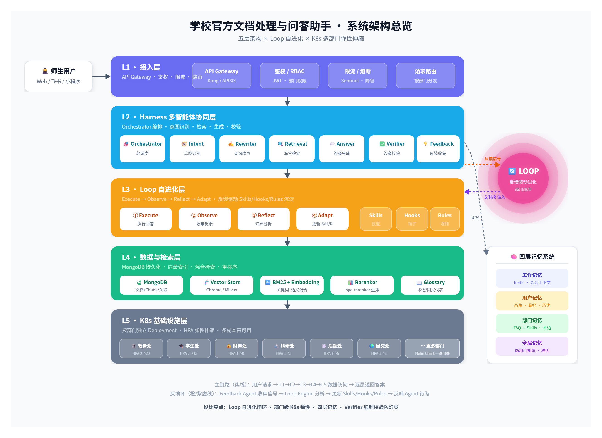
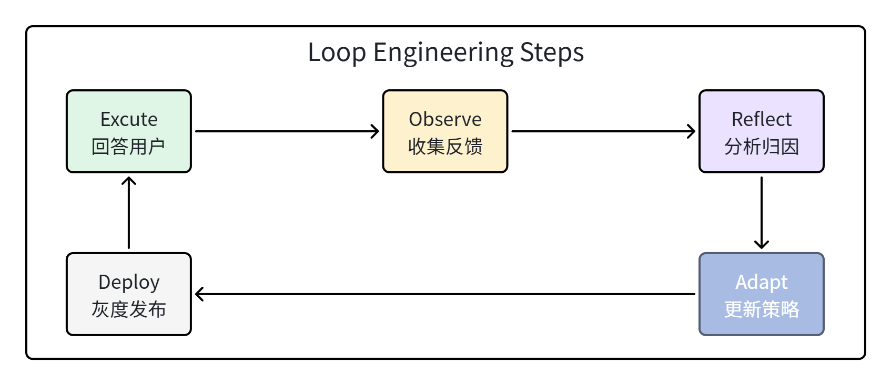
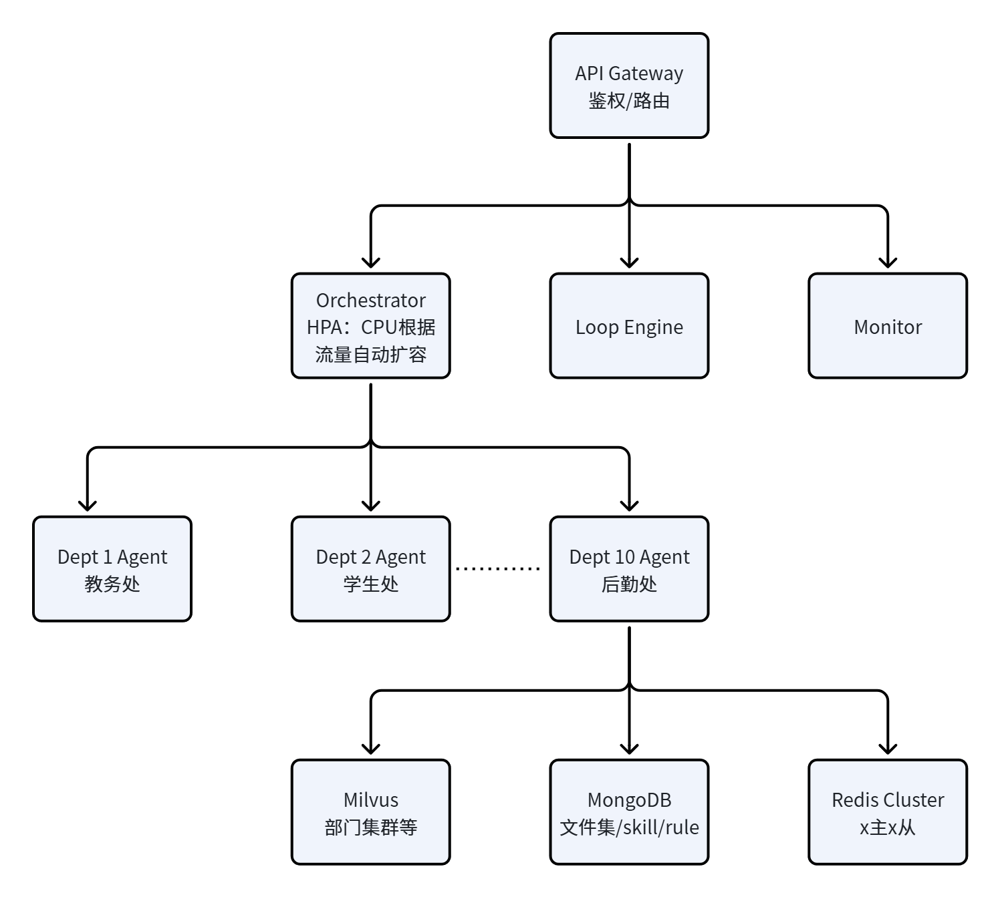

**Document purpose**: an engineering technical design that can be implemented directly, covering five modules: data storage, Loop self-optimization, Skill accumulation, multi-agent collaboration, and K8s high concurrency.

**Design principles**: feasibility first, closed-loop modules, clear highlights — connecting the full chain of "document ingestion → intelligent Q&A → self-evolution".

---

## 1. Project Overview

### 1.1 Project Goals

Build an intelligent processing and Q&A system for official policy documents across multiple school departments (Academic Affairs, Student Affairs, Finance, Human Resources, Logistics, Graduate School, etc.). Core capabilities:

- **Unified ingestion**: policy documents from each department (PDF/Word/Markdown) are automatically parsed, structured, and stored with versions in MongoDB.

- **Precise Q&A**: multi-agent intent recognition + hybrid retrieval answers faculty and student questions about policy clauses and traces each answer back to the source text.

- **Self-evolution**: Loop Engineering lets the system automatically accumulate Skills, Hooks, and Rules through real usage, becoming more accurate over time.

- **High-concurrency elasticity**: K8s deploys sub-agents per department to absorb traffic spikes such as the start of semester and course registration periods.

### 1.2 Core Design Philosophy

**Loop ≠ repeated execution**

It is only a Loop when the feedback signal genuinely changes the next round's behavior. Simple scheduled re-runs or polling refreshes are not a Loop.

**Humans progressively exit the Loop**

In the early stage, the Loop first defines the mutable scope and what "good" means; humans then gradually step out of the Loop so it can run on its own over the long term.

**Memory is capability**

The system does not just remember user preferences; it distills Skills, Hooks, and Rules from repeated behavior, forming reusable organizational knowledge.

### 1.3 Highlights

**Highlight 1: Loop self-evolution, with humans out of the loop**

Traditional RAG systems have fixed retrieval quality once launched. This design uses a feedback loop so the system gets more accurate with use — automatically distilling Skills/Hooks/Rules from bad cases. Over time, answer quality can significantly surpass the initial version, and **humans progressively exit the loop, achieving truly autonomous Loop Engineering.**

**Highlight 2: Department-level K8s elasticity for both cost and performance**

A complete backend microservice framework: instead of one large model service handling all traffic, each department scales independently. Low-traffic departments run 1 Pod to save cost, while high-traffic departments scale to 20 Pods during the start of semester to handle concurrency, for optimal resource utilization.

**Highlight 3: Multi-agent cross-department conflict detection**

Beyond passively answering questions, the system automatically detects conflicting clauses between departments' policies when documents are ingested (e.g., Academic Affairs and the Graduate School specifying the same matter differently) and proactively notifies admins to coordinate — something traditional document systems cannot do.

**Highlight 4: A lightweight custom Harness framework**

No dependency on code-heavy frameworks such as LangChain/AutoGen. Agent collaboration follows a fixed DAG as functionally required, so it can be generated directly, debugged, and maintained, avoiding the unpredictability introduced by framework abstraction layers.

---

## 2. Overall System Architecture

### 2.1 Core Architecture Diagram



### 2.2 Five-Layer Architecture

|Layer|Name|Core Components|Responsibilities|
|---|---|---|---|
|L1|Access layer|API Gateway / Feishu bot|Unified entry point, authentication, rate limiting, routing requests to the right department sub-agent|
|L2|Harness collaboration layer|Orchestrator / Intent Agent / Retrieval Agent / Answer Agent / Verifier Agent|Multi-agent orchestration, intent recognition, retrieval scheduling, answer generation and verification|
|L3|Loop evolution layer|Loop Engine / Skill Miner / Hook Engine / Rule Engine / Feedback Collector|Feedback-driven self-optimization loop, automatic Skill accumulation, dynamic Hook/Rule updates|
|L4|Data and retrieval layer|MongoDB / Vector Store (Chroma/Milvus) / Embedding Service / BM25 / Reranker|Document persistence, vector indexing, hybrid retrieval, reranking|
|L5|Infrastructure layer|K8s Cluster / Department Agent Pods / Redis / MQ / Monitoring|Per-department autoscaling, caching, message queues, observability|

---

## 3. MongoDB Storage Design for Multi-Department Policy Text

### 3.1 Data Model Design

MongoDB's BSON document model naturally fits the semi-structured nature of policy text (fields vary widely across departments, with many nested clauses and multi-version attachments). Core collections:

**Collection 1: `departments` (department metadata)**

```JSON
{
  "_id": "dept_jwc",
  "name": "Academic Affairs Office",
  "name_en": "Academic Affairs",
  "category": "academic",
  "admin_users": ["user_001", "user_002"],
  "agent_config": {
    "model": "gpt-4o-mini",
    "temperature": 0.1,
    "system_prompt_ref": "prompt_jwc_v3",
    "max_tokens": 2048
  },
  "created_at": "2026-01-10T08:00:00Z",
  "updated_at": "2026-07-15T14:30:00Z"
}
```

**Collection 2: `documents` (main document table)**

```JSON
{
  "_id": ObjectId("..."),
  "dept_id": "dept_jwc",
  "title": "Undergraduate Course Registration Regulations",
  "doc_type": "regulation",
  "version": "2025.2",
  "status": "active",
  "effective_date": "2025-09-01",
  "expiry_date": null,
  "supersedes": ObjectId("..."),
  "source": {
    "file_name": "course_registration_regulations_2025.pdf",
    "file_hash": "sha256:abc123...",
    "uploaded_by": "user_001",
    "uploaded_at": "2025-08-20T10:00:00Z"
  },
  "tags": ["course registration", "undergraduate", "credits"],
  "chunk_count": 42,
  "vector_status": "ready"
}
```

**Collection 3: `chunks` (chunk table, the minimal retrieval unit)**

```JSON
{
  "_id": ObjectId("..."),
  "doc_id": ObjectId("..."),
  "dept_id": "dept_jwc",
  "chunk_index": 3,
  "section_path": ["Chapter 3", "Article 12"],
  "section_title": "Course Registration Schedule",
  "content": "Students shall complete course registration for the next semester during weeks 16-18 of each semester...",
  "content_hash": "sha256:def456...",
  "char_count": 218,
  "embedding_id": "vec_xyz789",
  "keywords": ["registration period", "next semester", "week 16"],
  "metadata": {
    "page": 5,
    "has_table": false,
    "cross_refs": ["doc_xxx#chunk_7"]
  }
}
```

**Collection 4: `doc_relations` (cross-department document relations)**

```JSON
{
  "_id": ObjectId("..."),
  "from_doc": ObjectId("..."),
  "to_doc": ObjectId("..."),
  "relation_type": "reference|supersede|conflict|supplement",
  "description": "The course registration regulations reference the credit system regulations",
  "auto_detected": true,
  "confidence": 0.92,
  "verified_by": null
}
```

### 3.2 Data Processing Pipeline

**Flow**: upload → format parsing → cleaning → semantic chunking → metadata extraction → vectorization → index building → cross-department relation mining.

1. **Format parsing layer**: use `unstructured` / `pdfplumber` / `python-docx` / `BeautifulSoup` to handle PDF/Word/HTML/Markdown uniformly, preserving heading hierarchy, tables, and list structure.

2. **Cleaning and normalization**: remove headers, footers, and watermarks; OCR correction (PaddleOCR for scanned documents); full-width/half-width normalization; Traditional-to-Simplified conversion.

3. **Semantic chunking**: instead of hard-splitting by a fixed token count, split along clause-level semantic boundaries — using the heading hierarchy (chapter/section/article/clause) + semantic similarity (adjacent paragraphs are merged when their embedding cosine exceeds a threshold), targeting chunks of 300-600 characters so every answer can be traced to a specific clause.

4. **Metadata extraction**: the LLM automatically extracts `effective_date`, `doc_type`, `keywords`, `applicable_scope` (undergraduates/graduates/faculty and staff), and `cross_refs` (other documents referenced).

5. **Vectorization**: call an embedding model (`bge-m3` or `text-embedding-3-small` recommended), store vectors in Chroma/Milvus, and write `embedding_id` back to MongoDB.

6. **Cross-department relation mining**:

    - **Rule level**: regex-match reference patterns in the text such as "according to the XX Measures" or "pursuant to the XX Regulations".

    - **Semantic level**: when chunks from different departments' documents have embedding cosine > 0.85 and keyword overlap > 0.3, mark them as potentially related.

    - **Human review level**: high-confidence (>0.9) relations are created automatically; low-confidence ones go to a review queue for department admins to confirm.

### 3.3 Cross-Department Document Management Strategy

|Dimension|Approach|Implementation|
|---|---|---|
|Permission isolation|Every department document is bound to a `dept_id` and queries always carry a department filter; cross-department queries require the user to have cross-department permissions or the question itself to involve multiple departments (determined by the Intent Agent)|MongoDB compound index `dept_id + status`; application-level RBAC|
|Version management|Updates never overwrite the old version; a new version gets a new `_id`, and the `supersedes` field forms a version chain; old versions are marked `status=archived`, retrieval only queries `active` by default, but historical versions can still be traced|MongoDB `supersedes` pointer + status field|
|Conflict detection|When a new document is ingested, it is automatically compared semantically with similar documents from other departments; when clause conflicts are found (e.g., Academic Affairs says the course withdrawal deadline is week 8 while the Graduate School says week 10), they are marked `conflict` and the relevant departments are notified|`doc_relations` collection + scheduled scan job|
|Unified glossary|Maintain a `glossary` collection that maps the different names used by different departments for the same concept (e.g., "counselor ≈ class advisor ≈ supervisor") as synonyms, expanded automatically during retrieval|LLM extraction + human review|
|Lifecycle|Document state machine: draft → review → active → archived → deleted; expiring documents automatically remind the publishing department to review whether they need updating|MongoDB status field + scheduled Loop checks|

---

## 4. End-to-End Automated Document Management Optimization with Loop Engineering

### 4.1 The Boundary Between Loop and Automation

**Key distinction**:

- **Automation**: runs a fixed process on a schedule, with deterministic input, logic, and output. For example, "re-index new documents at 2 a.m. every day" — this is automation, not a Loop.

- **Loop (feedback loop)**: the results of each round are fed back as signals that **change the next round's behavior**. For example, "a user gives an answer a thumbs-down → analyze why → adjust the retrieval strategy / add chunks → similar questions get better answers next time" — this is a Loop.

### 4.2 Three Things Needed to Implement the Loop

**First: define the Mutable Scope**

Not everything in the system can be changed automatically; the boundaries must be explicit:

|Updatable Policy Scope|Auto-modifiable|Requires Human Review|Not Auto-modifiable|
|---|---|---|---|
|Skills|Trigger conditions, parameter templates|Skill body (prompt logic)|—|
|Hooks|Trigger thresholds, routing rules|Hook action definitions|—|
|Rules|Weights, priority, top-k|Rule content|—|

**Second: define "what counts as good" (Success Metric)**

The Loop needs explicit optimization goals; otherwise feedback signals cannot be quantified:

- **Answer quality**: user adoption rate (👍/👎), number of cited clauses per answer (≥1 to pass), Verifier Agent score (0-1).

- **Retrieval quality**: Hit Rate@5 (whether the top 5 chunks contain the answer), MRR (Mean Reciprocal Rank).

- **Efficiency**: first-token latency < 2s, end-to-end P99 < 8s, per-turn cost < ¥0.02.

- **Coverage**: unanswerable questions should be below 10% (answerable rate ≥ 90%).

**Third: let humans progressively exit the loop (Human Fade-out)**

**Phase 1: Human-in-the-loop**

All automatically generated Skills/Hooks/Rules must be reviewed by a human before taking effect. Humans make 100% of decisions.

**Phase 2: Human-on-the-loop**

High-confidence (>0.9) items skip human review and take effect automatically, while low-confidence ones go to the review queue; humans only handle exceptions and act as reviewers.

**Phase 3: Human-out-of-the-loop**

The system runs fully automatically within the defined scope; humans only set boundaries and goals and review periodically. Humans act as supervisors.

### 4.3 The Loop Engine Core Cycle



**The five stages in detail**:

1. **Execute**: answer user questions according to the current Skills/Hooks/Rules configuration and record the full trace (query, intent, retrieved_chunks, prompt, answer, latency, cost).

2. **Observe**: collect three kinds of feedback signals

    - **Explicit feedback**: thumbs-up/thumbs-down, the "answer is wrong" button, correction comments.

    - **Implicit feedback**: whether the user copied the answer, asked a follow-up (indicating dissatisfaction), and session duration.

    - **Automatic feedback**: Verifier Agent self-checks (whether the answer is supported by citations, whether it contradicts clauses) and retrieval Hit Rate statistics.

3. **Reflect**: the LLM analyzes the root cause of bad cases and classifies them as —

    - Retrieval issues (poor chunking / inaccurate embeddings / keywords not expanded)

    - Intent issues (wrong department routing / wrong question type)

    - Generation issues (hallucination / missing citations / off-topic answers)

    - Knowledge gaps (the documents genuinely lack this content)

4. **Adapt**: generate the corresponding Skill/Hook/Rule updates based on the root cause, entering the review or auto-apply flow of the mutable scope.
5. **Deploy**: canary release, testing the effectiveness of the new policy's responses, then back to the first stage of the Loop.

### 4.4 Skills, Hooks, and Rules as One

**Skills**

Procedural knowledge of "how to do it". When a kind of question recurs and has a stable solution, it is captured as a Skill.

Example: `deadline_query` — when answering "When is the XX deadline?" questions, automatically look up the current semester calendar and combine it with the specific clauses to give the deadline + a countdown.

**Hooks**

Event responses of "what to trigger when". Extra actions are triggered automatically when specific conditions are met.

Example: `cross_dept_hook` — when a question involves both "course registration" and "payment", automatically search both Academic Affairs and Finance documents and merge the answer.

**Rules**

Hard constraints that "must be obeyed". They have the highest priority and override the model's default behavior.

Example: `cite_source_rule` — every answer must include citations of the source clauses; `no_guess_rule` — when the documents contain no explicit answer, the system must say "No explicit provision was found in the current policy documents" and never fabricate.

---

## 5. Automatic Skill Accumulation and Optimization During the Loop

### 5.1 Skill Data Structure

Each Skill is stored in the MongoDB `skills` collection:

```JSON
{
  "_id": "skill_deadline_query",
  "name": "Deadline Lookup",
  "dept_id": "dept_jwc",
  "scope": "global|department",
  "trigger": {
    "intent_patterns": ["deadline", "when is the deadline", "latest date", "due date"],
    "entities_required": ["matter"],
    "confidence_threshold": 0.75
  },
  "action": {
    "type": "workflow|prompt|tool_call",
    "steps": [
      {"step": 1, "action": "extract_entity", "params": {"entity": "matter"}},
      {"step": 2, "action": "retrieve", "params": {"query": "{matter} deadline", "top_k": 5}},
      {"step": 3, "action": "call_tool", "params": {"tool": "calendar_lookup", "args": {"semester": "current"}}},
      {"step": 4, "action": "generate", "params": {"template": "deadline_template_v2"}}
    ]
  },
  "metrics": {
    "trigger_count": 342,
    "success_rate": 0.91,
    "avg_latency_ms": 1800,
    "last_triggered": "2026-07-15T16:20:00Z"
  },
  "version": 3,
  "status": "active",
  "auto_generated": true,
  "created_by": "loop_engine",
  "created_at": "2026-03-01T00:00:00Z"
}
```

### 5.2 Skill Generation Strategy

**Trigger condition**: the Skill Miner starts when the same question pattern (identified via embedding clustering) occurs ≥ 20 times within a 7-day window and the current general answer flow has a success rate < 80%.

**Generation flow**:

1. **Pattern clustering**: run embedding clustering (DBSCAN) on the most recent N bad cases / frequent queries to identify stable question-pattern clusters.

2. **Trace replay**: pull all session traces in the cluster, analyze which answers succeeded and which failed, and extract the common path of the successful answers.

3. **Skill draft generation**: the LLM generates a Skill draft (trigger conditions + action steps) from the successful path, including:

    - Trigger intent patterns (keywords/sentence templates extracted from the question cluster)

    - Required entities (e.g., "matter name", "year", "semester")

    - Execution steps (orchestration of retrieval → tool calls → generation)

    - Output template

4. **Sandbox validation**: backtest the new Skill on questions from historical traces; only a success rate > 85% sends it to the review queue.

5. **Canary release**: a new Skill first gets 10% of traffic; the success rates of the canary and control groups are compared, and it is rolled out fully only after a significant improvement (p < 0.05).

### 5.3 Automatic Skill Optimization Strategy

|Optimization Dimension|Strategy|
|---|---|
|Trigger condition optimization|Track each Skill's trigger precision (success rate after triggering) and recall (the share of cases where it should have triggered but did not), and automatically adjust `confidence_threshold` and `intent_patterns` — raise the threshold and add negative examples when false triggers are frequent; lower the threshold and add keywords when misses are frequent|
|Step optimization|A/B test action steps (e.g., top_k=3 vs top_k=5, whether to call the calendar tool), using a multi-armed bandit (Thompson Sampling) to automatically choose the best parameter combination|
|Template optimization|Output templates are fine-tuned automatically based on user feedback (e.g., if users keep asking "which article exactly?", article numbers are made mandatory in the template)|
|Skill merging/splitting|When two Skills' trigger patterns overlap heavily (Jaccard > 0.8) and their actions are similar, a merge is suggested automatically; when one Skill diverges into two clearly different answer paths, a split is suggested automatically|
|Skill downgrade/retirement|Skills with fewer than 5 triggers over 14 consecutive days or a success rate < 60% are marked `stale` and enter the archiving flow; old Skills replaced by new ones are automatically `deprecated`|

---

## 6. Harness Multi-Agent Collaboration

### 6.1 Agent Definitions and Responsibilities

The **Harness** is the multi-agent orchestration framework — instead of letting agents chat freely, a structured harness constrains each agent's input and output to ensure accurate intent recognition, effective retrieval, and reliable answers. It supports the standard OpenAI API and the Ollama interface for privately deployed local models (to meet privacy requirements).

|Agent|Role|Responsibilities|Input → Output|
|---|---|---|---|
|**Orchestrator**|Master scheduler|Receives user requests, coordinates each agent's workflow, decides between a single-department direct answer and cross-department collaboration, handles exceptions and timeouts|User Query → Execution Plan|
|**Intent Agent**|Intent recognition|Determines the question type (policy inquiry / procedure guidance / deadline lookup / complaint or suggestion / chitchat), the departments involved, the user's role (student/teacher/admin), and whether multi-department collaboration is needed|Query → Intent{type, depts, user_role, entities, needs_cross_dept}|
|**Query Rewriter**|Query rewriting|Rewrites and expands the original question: fills in omitted information (e.g., "withdrawal fee" → "course withdrawal handling fee and refund standard"), normalizes terminology (via the glossary), and generates multiple retrieval queries|Intent → Rewritten Queries[]|
|**Retrieval Agent**|Retrieval execution|Runs hybrid retrieval (BM25 keywords + vector semantics + metadata filter), calls the reranker, and returns the top-k chunks|Queries + Dept Filter → Ranked Chunks[]|
|**Answer Agent**|Answer generation|Generates answers from the retrieved chunks, citing sources strictly and formatting output according to Rules; merges sub-answers from multiple departments for cross-department questions|Chunks + Rules → Answer with Citations|
|**Verifier Agent**|Answer verification|Checks: (1) whether every conclusion is supported by a chunk (2) whether it contradicts the source (3) whether key information is missing (4) whether the citation format is correct. Failures are sent back to the Answer Agent for rewriting (up to 2 times)|Answer + Chunks → Verification Result{pass, issues[]}|
|**Feedback Agent**|Feedback collection|Prompts users for feedback after answering, handles follow-up questions/corrections, and writes signals to the feedback queue for the Loop Engine|User Reaction → Feedback Signal|

### 6.2 Agent Collaboration Flow

```JSON
User question
   │
   ▼
┌─────────────┐
│ Orchestrator │ ← Reads the Skills/Hooks/Rules configuration
└──────┬──────┘
       │
       ▼
┌─────────────┐    Recognize intent/departments/entities
│ Intent Agent │ ──→ Cross-department needed? → Fork department sub-tasks
└──────┬──────┘
       │
       ▼
┌───────────────┐
│ Query Rewriter │ ──→ Glossary expansion / multi-query generation
└──────┬────────┘
       │
       ▼
┌────────────────┐
│ Retrieval Agent │ ──→ BM25 + Vector + Rerank
└──────┬─────────┘
       │
       ▼
┌──────────────┐
│ Answer Agent │ ← Merges sub-answers for cross-department questions
└──────┬───────┘
       │
       ▼
┌───────────────┐
│ Verifier Agent │ ──→ Failed? Back to the Answer Agent (up to 2 times)
└──────┬────────┘
       │ pass
       ▼
   Return answer + citations
       │
       ▼
┌───────────────┐
│ Feedback Agent │ ──→ Collect feedback → Loop Engine
└───────────────┘
```

### 6.3 Memory System Design

The memory system is the "glue" of multi-agent collaboration, organized in four layers:

|Memory Layer|Storage|Content|Lifecycle|
|---|---|---|---|
|**Working memory**|Redis (current session)|Context of the current conversation: the last N turns, recognized intent, retrieved chunks, intermediate reasoning results. Structured as a Conversation Session object, TTL=30min|Session level|
|**User memory**|MongoDB `user_profiles`|User profile: role (student/teacher), school/department, year, frequently consulted departments, historically frequent question types, preferences (e.g., concise answers vs. detailed clause citations), feedback history|User level, long-term|
|**Department memory**|MongoDB `dept_memory`|Department-level knowledge: the department's Skills/Hooks/Rules, common FAQs (accumulated automatically from frequent Q&A pairs), glossary, known conflicting clauses, hot-question trends|Department level, long-term, updated by the Loop|
|**Global memory**|MongoDB `global_memory`|Knowledge shared across departments: cross-department Skills (e.g., "leave of absence" involves Academic Affairs + Student Affairs + Finance), global Rules, system-level Hooks, the semester calendar, campus-wide terminology|Global, long-term|

**Memory write strategy**:

- **Real-time writes**: after each conversation turn, the Feedback Agent writes the session summary to user memory; frequent patterns update the hot counters in department memory in real time.

- **Batch writes**: the Loop Engine batch-analyzes the day's traces early every morning to update Skills/Hooks/Rules/FAQs.

- **Memory decay**: preferences in user memory inactive for more than 180 days are automatically down-weighted; FAQs in department memory not triggered for 90 consecutive days are archived.

**Memory retrieval strategy**:

- The Intent Agent loads the user profile (from user memory) + global Rules at startup.

- In addition to document chunks, the Retrieval Agent also searches department FAQs (preferring a direct FAQ match).

- The Answer Agent injects relevant department memory (terminology, Rules) and user preferences (concise/detailed) during generation.

---

## 7. K8s High-Concurrency Design for Multi-Department Sub-Agents

### 7.1 Deployment Architecture

**Core idea**: each department's agent stack (Intent + Retrieval + Answer + Verifier) is an independent Deployment that scales automatically on QPS via HPA; the Orchestrator and Loop Engine are deployed independently as global services. Resources are isolated between departments, so high-traffic departments (e.g., Academic Affairs at the start of semester) cannot starve others.



### 7.2 Department Agent Pod Design

Each department's agent Pod runs a lightweight FastAPI service that loads the department-specific configuration:

```YAML
# Example Academic Affairs agent Deployment
apiVersion: apps/v1
kind: Deployment
metadata:
  name: dept-agent-jwc
  labels:
    app: dept-agent
    department: jwc
spec:
  replicas: 2
  selector:
    matchLabels:
      app: dept-agent
      department: jwc
  template:
    metadata:
      labels:
        app: dept-agent
        department: jwc
    spec:
      containers:
      - name: agent
        image: school-doc-agent:v1.0
        env:
        - name: DEPT_ID
          value: "dept_jwc"
        - name: MODEL_NAME
          value: "gpt-4o-mini"
        - name: MONGODB_URI
          valueFrom:
            secretKeyRef:
              name: mongodb-secret
              key: uri
        - name: REDIS_ADDR
          value: "redis-cluster:6379"
        resources:
          requests:
            cpu: "500m"
            memory: "512Mi"
          limits:
            cpu: "2000m"
            memory: "2Gi"
---
apiVersion: autoscaling/v2
kind: HorizontalPodAutoscaler
metadata:
  name: dept-agent-jwc-hpa
spec:
  scaleTargetRef:
    apiVersion: apps/v1
    kind: Deployment
    name: dept-agent-jwc
  minReplicas: 2
  maxReplicas: 20  # Academic Affairs scales out to 20 Pods at peak
  metrics:
  - type: Pods
    pods:
      metric:
        name: http_requests_per_second
      target:
        type: AverageValue
        averageValue: "10"  # Scale out when each Pod handles 10 requests per second
  behavior:
    scaleUp:
      stabilizationWindowSeconds: 30
      policies:
      - type: Pods
        value: 3
        periodSeconds: 30
    scaleDown:
      stabilizationWindowSeconds: 300
```

### 7.3 Key Backend High-Concurrency Design

|Design Point|Approach|Technology|
|---|---|---|
|Department-level isolation|Each department has its own Deployment + HPA so resources never compete; low-traffic departments (e.g., International Exchange Office) use minReplicas=1 to save resources, while high-traffic departments (Academic Affairs / Student Affairs) use minReplicas=2 and maxReplicas=20|K8s HPA + Pod anti-affinity|
|Multi-level caching|L1 Redis caches frequent Q&A pairs (TTL=1h); L2 in-memory cache for embedding results; L3 browser cache for static assets. Hot questions (e.g., "How do I register for courses?") hit the cache directly without calling the LLM|Redis Cluster + in-memory LRU|
|Async processing|Non-real-time tasks such as feedback collection, Skill mining, and index updates go through a message queue (RabbitMQ/Redis Stream) and never block the main Q&A path|Redis Stream / RabbitMQ|
|Streaming output|The Answer Agent supports SSE streaming with first-token latency < 2s for a better user experience|FastAPI SSE + OpenAI streaming|
|Rate limiting and degradation|Rate limiting per department + user at the API Gateway layer; on LLM failure, degrade to FAQ matching or Elasticsearch source-text retrieval; end-to-end timeout control (Intent 200ms / Retrieval 1s / Answer 5s)|APISIX rate-limit plugin + circuit breaker|
|Connection pool management|MongoDB/Redis/LLM APIs all use connection pools to avoid the overhead of new connections per request; the LLM API supports batching requests|motor (async mongo) + aioredis|
|Warm-up|Before known peaks such as the start of semester and course registration, scale out high-traffic department Pods in advance, preload hot FAQs into the cache, and warm up the embedding index|CronHPA + warm-up scripts|

### 7.4 Network Communication for Cross-Department Collaboration

When the Intent Agent determines that a question needs a cross-department answer (e.g., "How do I get a refund after taking a leave of absence?" involves Academic Affairs + Student Affairs + Finance), the Orchestrator calls multiple department agents in parallel via gRPC/HTTP:

```Python
# Orchestrator pseudocode
async def handle_cross_dept_query(query: str, depts: list[str]):
    tasks = []
    for dept_id in depts:
        # Discover the department agent via the K8s Service
        url = f"http://dept-agent-{dept_id}.namespace.svc.cluster.local/answer"
        tasks.append(asyncio.create_task(
            session.post(url, json={"query": query, "mode": "sub_answer"}, timeout=5)
        ))
    # Wait for all departments in parallel; departments that time out after 2s degrade to "information from this department is temporarily unavailable"
    results = await asyncio.gather(*tasks, return_exceptions=True)
    # The Answer Agent merges the sub-answers
    merged = await answer_agent.merge_sub_answers(results, query)
    return merged
```

---

## 8. Tech Stack and Implementation Path

### 8.1 Recommended Tech Stack

| Module | Technology | Rationale |
| ------- | ------------------------------------------------------- | ------------------------------------------------------- |
| Backend framework | Python 3.11 + FastAPI | Natively async, auto-generated OpenAPI docs, rich ecosystem, high accuracy for generated code |
| Database | MongoDB 7.0 (motor async driver) | The document model naturally fits policy text; a flexible schema accommodates field differences across departments; replica sets ensure high availability |
| Vector retrieval | Chroma (to start) → Milvus (at scale) | Chroma is lightweight and embedded with zero ops during development; switch to a Milvus cluster beyond 1 million chunks |
| Cache/messaging | Redis 7 (Cluster mode) | Cache + session storage + message queue (Stream) in one, reducing the number of components |
| LLM | deepseek-v4-flash (primary) + locally deployed Qwen2.5-7B (fallback) | deepseek-v4-flash is cost-effective; the local model guards against API outages; embeddings use bge-m3 |
| Document parsing | unstructured + pdfplumber + PaddleOCR + python-docx | Covers mainstream formats; PaddleOCR handles scanned documents; unstructured preserves document structure |
| Agent framework | Custom lightweight Harness (no LangChain/AutoGen) | Agent interaction in this design is a fixed DAG and needs no heavy framework; a custom build is more controllable and can be generated directly |
| Container orchestration | Kubernetes + Docker + Helm | The core of per-department autoscaling; Helm Charts template the deployment of new department agents |
| Observability | Prometheus + Grafana + Loki + OpenTelemetry | Metrics, logs, and tracing together; quickly pinpoint bad cases |

### 8.2 Implementation Order (4 Sprints Recommended)

**Implementation principle**: every Sprint delivers a demonstrable increment, with no big-bang releases. Code is completed module by module per Sprint, and every module is independently testable.

**Sprint 1 (2 weeks): Data foundation + basic Q&A**

- MongoDB schema design + index creation

- Document upload/parsing/chunking/vectorization Pipeline

- Basic RAG Q&A (single department, no agent collaboration)

- Minimal web chat interface

**Sprint 2 (2 weeks): Multi-agent Harness**

- Intent Agent / Retrieval Agent / Answer Agent / Verifier Agent implementation

- Query Rewriter + hybrid retrieval (BM25 + Vector + Rerank)

- Memory system (working memory + user memory)

- Cross-department collaborative calls

**Sprint 3 (2 weeks): Loop Engine + Skill accumulation**

- Feedback collection mechanism (explicit + implicit + automatic)

- Four-stage Loop cycle (Execute/Observe/Reflect/Adapt)

- Skill Miner automatic clustering + Skill generation + sandbox backtesting

- Hook / Rule engines

- Canary release mechanism

**Sprint 4 (2 weeks): K8s deployment + high-concurrency optimization**

- Docker images + Helm Chart (templated department agents)

- HPA autoscaling + rate limiting and degradation

- Redis multi-level caching + streaming output

- Prometheus/Grafana monitoring dashboards

- Load testing + start-of-semester peak contingency plan

